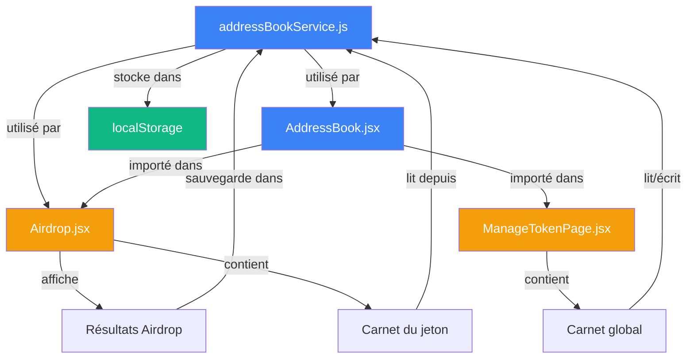

# 📇 Carnet d'Adresses - Arborescence des Fichiers

```
farm-wallet-independant/
│
├── src/
│   ├── services/
│   │   └── addressBookService.js ············· ✅ NOUVEAU (220 lignes)
│   │       └─ Service de gestion du carnet d'adresses
│   │          • Stockage localStorage (clé: jln_address_book)
│   │          • CRUD: getContacts, saveContact, deleteContact
│   │          • Recherche et filtrage
│   │          • Export/Import JSON
│   │
│   ├── components/
│   │   ├── AddressBook.jsx ··················· ✅ NOUVEAU (500 lignes)
│   │   │   └─ Composant réutilisable
│   │   │      • Mode compact (Airdrop)
│   │   │      • Mode complet (ManageTokenPage)
│   │   │      • Props: tokenId, onSelectAddress, compact
│   │   │
│   │   └── TokenPage/
│   │       └── TokenActions/
│   │           └── Airdrop.jsx ················ ✏️ MODIFIÉ (+200 lignes)
│   │               └─ Améliorations:
│   │                  • Affichage adresse complète
│   │                  • Sauvegarde inline dans carnet
│   │                  • Bouton toggle carnet du jeton
│   │                  • Section carnet masquable
│   │
│   └── pages/
│       └── ManageTokenPage.jsx ··············· ✏️ MODIFIÉ (+40 lignes)
│           └─ Section carnet d'adresses global
│              • Masquable avec toggle
│              • Au-dessus de "Historique Créateur"
│              • Affiche tous les contacts (tous tokens)
│
└── docs/
    ├── ADDRESS_BOOK_SYSTEM.md ················ ✅ NOUVEAU (300 lignes)
    │   └─ Documentation technique complète
    │      • Architecture et structure
    │      • API du service
    │      • Props du composant
    │      • Cas d'usage
    │      • Tests recommandés
    │      • Évolutions futures
    │
    ├── ADDRESS_BOOK_IMPLEMENTATION.md ········ ✅ NOUVEAU (400 lignes)
    │   └─ Récapitulatif d'implémentation
    │      • Objectifs atteints
    │      • Fichiers créés/modifiés
    │      • Structure des données
    │      • API et interface
    │      • Scénarios de test
    │      • Checklist de validation
    │
    ├── ADDRESS_BOOK_USER_GUIDE.md ············ ✅ NOUVEAU (250 lignes)
    │   └─ Guide utilisateur
    │      • Démarrage rapide
    │      • Cas d'usage pratiques
    │      • Sécurité & confidentialité
    │      • Dépannage
    │      • FAQ
    │
    └── PROJECT_STATUS.md ····················· ✏️ MODIFIÉ (+50 lignes)
        └─ Ajout section "Système de Carnet d'Adresses"
           • Vue d'ensemble
           • Fichiers ajoutés
           • Fonctionnalités
           • Évolution prévue
```

---

## 📊 Statistiques

### Code source
- **Nouveau code** : ~920 lignes
  - Service : 220 lignes
  - Composant : 500 lignes
  - Modifications Airdrop : ~200 lignes
  - Modifications ManageTokenPage : ~40 lignes (dont suppression de duplications)

### Documentation
- **Nouvelle documentation** : ~1000 lignes
  - Documentation technique : 300 lignes
  - Récapitulatif implémentation : 400 lignes
  - Guide utilisateur : 250 lignes
  - Mise à jour PROJECT_STATUS : 50 lignes

### Total
- **~1920 lignes** de code et documentation
- **3 nouveaux fichiers** de code
- **3 nouveaux fichiers** de documentation
- **2 fichiers** modifiés

---

## 🔗 Relations entre fichiers



**Légende** :
- 🔵 Bleu : Nouveaux fichiers
- 🟠 Orange : Fichiers modifiés
- 🟢 Vert : Stockage

---

## 🎯 Points d'entrée utilisateur

### 1. Airdrop - Résultats du scan
```
TokenPage → Onglet "Airdrop" → Bouton "Calculer détenteurs"
          → Liste des détenteurs (adresses complètes + sauvegarde)
```

### 2. Airdrop - Carnet du jeton
```
TokenPage → Onglet "Airdrop" → Sous "Distribuer maintenant"
          → Bouton "📇 Afficher le carnet d'adresses du jeton"
```

### 3. ManageTokenPage - Carnet global
```
ManageTokenPage → Section "Carnet d'Adresses Complet"
                → Bouton "👁️ Afficher"
```

---

## 🔄 Flux de données

### Sauvegarde d'un contact (Airdrop)
```
1. Utilisateur clique "💾 Sauvegarder dans le carnet"
2. Input inline s'affiche
3. Utilisateur entre un nom
4. Validation (Enter ou ✅)
5. addressBookService.saveContact(address, name, tokenId)
6. localStorage mis à jour
7. Re-render → Nom s'affiche avec icône 👤
```

### Chargement des contacts (Airdrop)
```
1. calculatedHolders.map() itère sur les détenteurs
2. Pour chaque holder:
   a. addressBookService.getContactByAddress(address, tokenId)
   b. Si contact existe → afficher nom + icône 👤
   c. Sinon → afficher bouton "💾 Sauvegarder"
```

### Export/Import
```
Export:
1. addressBookService.exportContacts()
2. JSON.stringify(contacts)
3. Blob → téléchargement fichier

Import:
1. Utilisateur sélectionne fichier JSON
2. file.text() → JSON.parse()
3. Fusion avec contacts existants (update si plus récent)
4. localStorage mis à jour
```

---

## 🧪 Tests manuels recommandés

### ✅ Checklist de validation

- [ ] **Test 1** : Sauvegarder un contact depuis Airdrop
- [ ] **Test 2** : Vérifier persistance après recalcul
- [ ] **Test 3** : Afficher carnet du jeton
- [ ] **Test 4** : Retirer un contact du carnet
- [ ] **Test 5** : Carnet global - Ajouter contact
- [ ] **Test 6** : Carnet global - Rechercher
- [ ] **Test 7** : Carnet global - Modifier nom
- [ ] **Test 8** : Carnet global - Supprimer
- [ ] **Test 9** : Exporter en JSON
- [ ] **Test 10** : Importer depuis JSON
- [ ] **Test 11** : Validation adresse (sans ecash:)
- [ ] **Test 12** : Validation nom vide
- [ ] **Test 13** : Persistance après refresh page
- [ ] **Test 14** : Copie adresse au clic

---

## 🚀 Déploiement

### Fichiers à commiter

```bash
git add src/services/addressBookService.js
git add src/components/AddressBook.jsx
git add src/components/TokenPage/TokenActions/Airdrop.jsx
git add src/pages/ManageTokenPage.jsx
git add docs/ADDRESS_BOOK_SYSTEM.md
git add docs/ADDRESS_BOOK_IMPLEMENTATION.md
git add docs/ADDRESS_BOOK_USER_GUIDE.md
git add PROJECT_STATUS.md

git commit -m "feat: Add complete address book system

- New addressBookService for contact management
- New AddressBook component (compact/full modes)
- Enhanced Airdrop with inline contact saving
- Global address book in ManageTokenPage
- Full documentation (technical, implementation, user guide)
- Export/Import JSON functionality
- Search and filtering
- localStorage persistence

Closes #[issue-number]"
```

### Vérifications avant déploiement

- [x] Aucune erreur ESLint
- [x] Aucune erreur TypeScript
- [x] Aucune erreur de compilation
- [x] Documentation complète
- [ ] Tests manuels validés
- [ ] Review code par un pair
- [ ] Tests E2E ajoutés (si applicable)

---

**Date de création** : 16 décembre 2025  
**Version** : 1.0  
**Status** : ✅ Prêt pour déploiement
