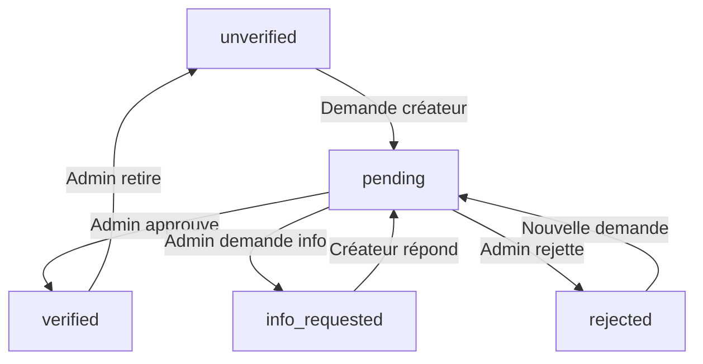
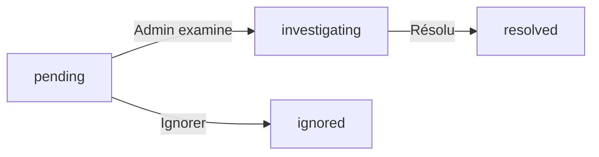

# Documentation des Badges et Statuts

## Vue d'ensemble

L'application utilise plusieurs types de statuts et badges pour gérer les fermes, la vérification, les signalements et l'état global. Ce document centralise toute l'information.

---

## 1. STATUTS DE VÉRIFICATION (`verification_status`)

Statut principal qui gère le cycle de vie de la vérification d'une ferme.

### Valeurs possibles

| Statut | Badge | Couleur | Description | Actions possibles |
|--------|-------|---------|-------------|-------------------|
| `unverified` | 📋 Non vérifié | Gris (`#f3f4f6`) | État initial après création | Demander vérification |
| `pending` | ⏳ En attente | Jaune (`#fef3c7`) | Demande soumise, en attente admin | Envoyer message (créateur) |
| `info_requested` | 💬 Info demandée | Bleu (`#dbeafe`) | Admin a demandé plus d'infos | Répondre aux questions |
| `verified` | ✅ Vérifié | Vert (`#dcfce7`) | Ferme approuvée | Retirer vérification (admin) |
| `rejected` | 🚫 Refusé | Rouge (`#fee2e2`) | Demande rejetée | Redemander vérification |

### Flux de vérification



### Où c'est utilisé

- **Base de données** : Colonne `verification_status` dans `farms`
- **Composants** : 
  - `ManageFarmPage.jsx` : Affichage et gestion côté créateur
  - `AdminVerificationPage.jsx` : Gestion côté admin
  - `DirectoryPage.jsx` : Badge dans liste des fermes
- **Services** : 
  - `farmService.js` : Méthodes `changeVerificationStatus()`, `addMessage()`
  - `useFarmStatus.js` : Hook `sendMessage()` qui change le statut

---

## 2. STATUT GLOBAL DE LA FERME (`status`)

Statut administratif qui peut bloquer complètement une ferme.

### Valeurs possibles

| Statut | Badge | Couleur | Description | Impact |
|--------|-------|---------|-------------|--------|
| `active` | ✅ Actif | Vert (`#dcfce7`) | Ferme normale et visible | Aucun |
| `hidden` | 👁️ Masqué | Gris | Masquée du répertoire | Non visible dans DirectoryPage |
| `banned` | 🛑 Banni | Rouge (`#fee2e2`) | Ferme bannie définitivement | Lecture seule, non visible |
| `pending_deletion` | ⏳ Suppression | Jaune (`#fef3c7`) | En attente de suppression (7 jours) | Lecture seule, compteur visible |

### Hiérarchie de priorité

1. **`banned`** : Bloque TOUTES les actions
2. **`pending_deletion`** : Bloque modifications, autorise annulation
3. **`hidden`** : N'affecte que la visibilité
4. **`active`** : État normal

### Où c'est utilisé

- **Base de données** : Colonne `status` dans `farms`
- **Composants** :
  - `ManageFarmPage.jsx` : Affiche alertes selon le statut
  - `DirectoryPage.jsx` : Filtre les fermes actives
  - `AdminVerificationPage.jsx` : Actions admin
- **Services** :
  - `farmService.js` : `softDeleteFarm()`, `cancelDeletion()`, `permanentDelete()`
  - `useFarmStatus.js` : `changeStatus()`, `banFarm()`

---

## 3. STATUTS DE SIGNALEMENT (`admin_status`)

Statut pour gérer les signalements reçus par l'admin.

### Valeurs possibles

| Statut | Badge | Couleur | Description | Actions |
|--------|-------|---------|-------------|---------|
| `pending` | ⏳ En attente | Jaune (`#fef3c7`) | Nouveau signalement | Examiner |
| `investigating` | 🔍 En examen | Bleu (`#dbeafe`) | Admin en train d'examiner | Continuer examen |
| `resolved` | ✅ Résolu | Vert (`#dcfce7`) | Traité et résolu | Aucun |
| `ignored` | ⏭️ Ignoré | Gris (`#f3f4f6`) | Signalement ignoré | Aucun |

### Cycle de vie d'un signalement



### Où c'est utilisé

- **Base de données** : Colonne `admin_status` dans `farm_reports`
- **Composants** :
  - `AdminVerificationPage.jsx` : Onglet "signalé" avec filtres par statut
  - `Communication/index.jsx` : Badge dans ReportsSection
- **Services** :
  - `useFarmStatus.js` : `resolveAllReports()`, `sendReportMessage()`

---

## 4. VISIBILITÉ DES SIGNALEMENTS (`visible_to_farmer`)

Booléen qui contrôle si un signalement est visible pour le créateur de la ferme.

### Valeurs

| Valeur | Description | Impact |
|--------|-------------|--------|
| `true` | Visible au créateur | Apparaît dans ReportsSection |
| `false` | Masqué au créateur | Invisible côté créateur |

### Logique

- **Par défaut** : `false` lors de la création d'un signalement
- **Contrôle** : Admin coche "Visible au créateur" lors d'envoi de message
- **Affichage** : Section "Signalements reçus" n'apparaît QUE si au moins 1 report avec `visible_to_farmer = true`

### Où c'est utilisé

- **Base de données** : Colonne `visible_to_farmer` dans `farm_reports`
- **Composants** :
  - `Communication/index.jsx` : 
    - `ReportsSection` filtre par `visible_to_farmer === true` (ligne 249)
    - `AdminReportMessaging` a une checkbox pour contrôler la valeur
- **Services** :
  - `useFarmStatus.js` : `sendReportMessage()` toggle automatique si checkbox cochée

---

## 5. ÉTAT DE CONVERSATION (`conversation_closed`)

Booléen qui contrôle si la conversation de vérification est fermée par l'admin.

### Valeurs

| Valeur | Description | Impact |
|--------|-------------|--------|
| `true` | Conversation fermée | Section "Messages de vérification" masquée |
| `false` | Conversation ouverte | Section visible |

### Logique

- **Contrôle** : Admin ferme la conversation via bouton "Clôturer conversation"
- **Impact** : 
  - Côté créateur : Section de vérification disparaît complètement
  - Côté admin : Conversation toujours accessible
  - Les messages restent en base mais ne sont plus affichés

### Où c'est utilisé

- **Base de données** : Colonne `conversation_closed` dans `farms`
- **Composants** :
  - `Communication/index.jsx` : 
    - `showVerification = !conversation_closed` (ligne 41)
    - Masque toute la section si `true`
- **Services** :
  - `useFarmStatus.js` : `closeConversation()`

---

## 6. TYPES DE MESSAGES (`type` dans communication_history)

Catégorise les messages dans l'historique de communication.

### Valeurs

| Type | Description | Section | Émetteur |
|------|-------------|---------|----------|
| `verification` | Messages de vérification | Messages de vérification | Admin ou Créateur |
| `general` | Messages généraux | Messages généraux | Admin ou Créateur |
| `report` | Messages de signalement | Signalements reçus | Admin uniquement |

### Séparation stricte

- Chaque type a sa **propre section** dans l'interface
- Les messages ne peuvent **pas se mélanger** entre sections
- Filtrage par type lors de l'affichage

### Où c'est utilisé

- **Base de données** : Champ `type` dans array `communication_history` (JSONB)
- **Composants** :
  - `Communication/index.jsx` : 
    - Filtre par type pour chaque section (lignes 44-47)
    - 3 composants dédiés : CommunicationSection, AdminChatSection, AdminReportMessaging
- **Services** :
  - `farmService.js` : `addMessage(messageType)` ajoute le type au message
  - `useFarmStatus.js` : `sendMessage(messageType)` passe le type

---

## 7. STRUCTURE DES MESSAGES

### Format d'un message dans `communication_history`

```javascript
{
  author: 'creator' | 'admin' | 'user',
  message: 'Texte du message',
  timestamp: 'ISO 8601 date',
  type: 'verification' | 'general' | 'report'
}
```

### Règles

- **`author`** : 
  - `'creator'` : Propriétaire de la ferme
  - `'admin'` : Administrateur
  - `'user'` : Utilisateur lambda (non utilisé actuellement)

- **Changement de statut** : 
  - Seuls les messages `type: 'verification'` de l'admin changent `verification_status`
  - Les messages `general` et `report` ne touchent pas au statut

---

## 8. AFFICHAGE DES BADGES

### Composant `StatusBadge`

```jsx
<StatusBadge 
  status="pending" 
  type="verification" 
/>
```

#### Props

- **`status`** : Valeur du statut à afficher
- **`type`** : Type de badge
  - `'verification'` : Statuts de vérification
  - `'farm'` : Statuts globaux de ferme
  - `'report'` : Statuts de signalement
- **`className`** : Classes CSS additionnelles

### Où StatusBadge est utilisé

1. **AdminVerificationPage.jsx** (ligne 282)
   - Affiche `verification_status` dans la liste des fermes

2. **Communication/index.jsx** (ligne 305)
   - Affiche `admin_status` des signalements dans ReportsSection

3. Peut être utilisé partout où un statut doit être affiché

---

## 9. RÈGLES MÉTIER IMPORTANTES

### Priorité des actions selon le statut

```
banned > pending_deletion > verification_status > conversation_closed
```

1. Si `status === 'banned'` → Aucune action possible
2. Si `status === 'pending_deletion'` → Seulement annulation possible
3. Si `conversation_closed === true` → Section vérification masquée
4. Sinon → Actions selon `verification_status`

### Visibilité dans DirectoryPage

Une ferme apparaît SI :
- `status === 'active'` (pas banned, pas pending_deletion, pas hidden)
- ET filtre de recherche correspond
- ET filtre de vérification correspond (si sélectionné)

### Messages de vérification vs généraux

- **Vérification** : 
  - Visible seulement si `!conversation_closed`
  - Change `verification_status` si message admin
  - Limité aux 4 derniers avec bouton "Voir tout"

- **Généraux** : 
  - Toujours visible
  - Ne change pas `verification_status`
  - Limité aux 4 derniers avec bouton "Voir tout"

### Signalements

- **Création** : `visible_to_farmer = false` par défaut
- **Affichage** : Section apparaît seulement si au moins 1 report visible
- **Messages** : Type `report`, stockés dans `communication_history`
- **Résolution** : `resolveAllReports()` met tous les reports en `admin_status: 'resolved'`

---

## 10. SCHÉMA BASE DE DONNÉES

### Table `farms`

```sql
verification_status TEXT DEFAULT 'unverified' 
  CHECK (verification_status IN ('unverified', 'pending', 'info_requested', 'verified', 'rejected'))

status TEXT DEFAULT 'active'
  CHECK (status IN ('active', 'hidden', 'banned', 'pending_deletion'))

conversation_closed BOOLEAN DEFAULT false

communication_history JSONB DEFAULT '[]'
  -- Array de {author, message, timestamp, type}
```

### Table `farm_reports`

```sql
admin_status TEXT DEFAULT 'pending'
  CHECK (admin_status IN ('pending', 'investigating', 'resolved', 'ignored'))

visible_to_farmer BOOLEAN DEFAULT false
```

---

## 11. FICHIERS PRINCIPAUX

### Composants
- `/src/components/UI.jsx` : Définition de `StatusBadge` (lignes 522-557)
- `/src/components/Communication/index.jsx` : Affichage des sections de messages
- `/src/pages/ManageFarmPage.jsx` : Gestion côté créateur
- `/src/pages/AdminVerificationPage.jsx` : Gestion côté admin
- `/src/pages/DirectoryPage.jsx` : Liste publique des fermes

### Services
- `/src/services/farmService.js` : Méthodes CRUD avec gestion des statuts
- `/src/hooks/useFarmStatus.js` : Hook pour actions sur statuts
- `/src/data/supabaseReports.js` : Gestion des signalements

---

## 12. RÉFÉRENCE RAPIDE

### Quand utiliser quel statut ?

| Besoin | Champ à modifier |
|--------|------------------|
| Approuver une ferme | `verification_status = 'verified'` |
| Bannir une ferme | `status = 'banned'` |
| Masquer du répertoire | `status = 'hidden'` |
| Marquer pour suppression | `status = 'pending_deletion'` + `deletion_date` |
| Demander info au créateur | `verification_status = 'info_requested'` + message |
| Fermer la conversation | `conversation_closed = true` |
| Montrer un signalement | `visible_to_farmer = true` sur le report |
| Traiter un signalement | `admin_status = 'resolved'` |

### Quel badge utiliser ?

```jsx
// Statut de vérification
<StatusBadge status={farm.verification_status} type="verification" />

// Statut global de ferme
<StatusBadge status={farm.status} type="farm" />

// Statut de signalement
<StatusBadge status={report.admin_status} type="report" />
```

---

## 13. MIGRATION ET COHÉRENCE

### Valeurs par défaut à la création

```javascript
{
  verification_status: 'unverified',
  status: 'active',
  conversation_closed: false,
  communication_history: [],
  // Pour les reports:
  admin_status: 'pending',
  visible_to_farmer: false
}
```

### Transitions invalides à éviter

- ❌ Passer de `banned` à `active` sans justification
- ❌ Changer `verification_status` si `status === 'banned'`
- ❌ Mettre `conversation_closed = false` après résolution
- ❌ Mettre `visible_to_farmer = true` sur tous les reports par défaut

---

## 14. TESTS ET VALIDATION

### À tester

- [ ] Changement de `verification_status` met à jour le badge
- [ ] `status = 'banned'` bloque toutes les actions
- [ ] `conversation_closed = true` masque la section
- [ ] Messages de type `verification` changent le statut
- [ ] Messages de type `general` ne changent pas le statut
- [ ] Reports avec `visible_to_farmer = false` ne s'affichent pas
- [ ] Section signalements n'apparaît pas si aucun report visible

---

## Conclusion

Ce système à 3 niveaux (vérification, statut global, signalements) permet une gestion granulaire :

1. **`verification_status`** : Cycle de vie de la vérification
2. **`status`** : Contrôle administratif global
3. **`admin_status`** : Gestion des signalements
4. **`conversation_closed`** : Contrôle de la conversation
5. **`visible_to_farmer`** : Visibilité des signalements
6. **`type` de message** : Séparation stricte des communications

**Point clé** : Les statuts sont hiérarchiques - le statut global (`banned`) prime sur tout le reste.
