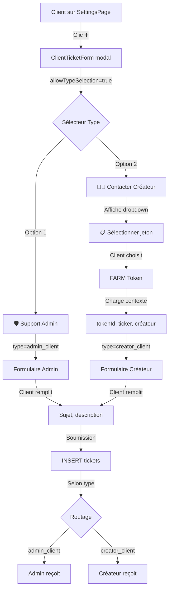
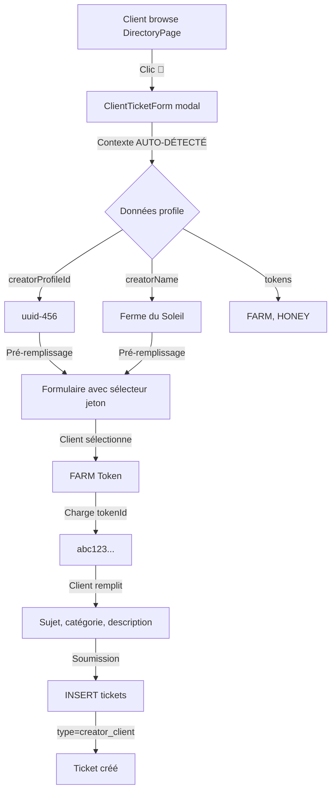
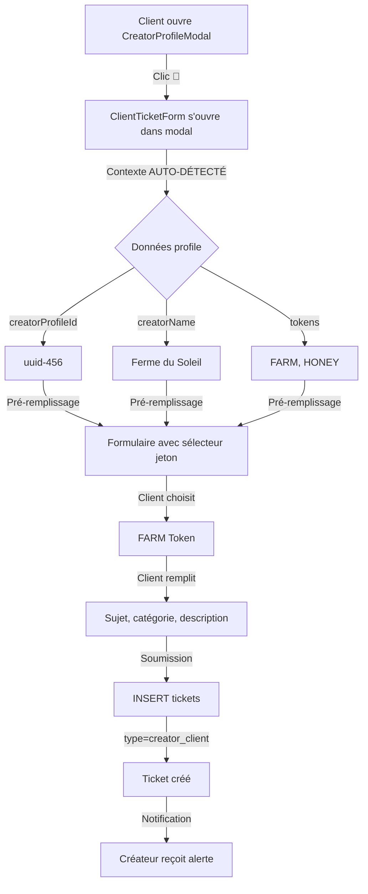

# Flux Tickets Client - Guide Complet

**Date:** 18 décembre 2025  
**Objectif:** Détailler le système de tickets côté client avec suivi optimal

---

## 🎯 Vue d'ensemble

Le client peut créer des tickets via **3 points d'entrée** :
1. **SettingsPage** : Support général (Admin ou Créateur au choix)
2. **DirectoryPage** : Contacter un créateur via sa CreatorProfileCard
3. **CreatorProfileModal** : Contacter un créateur depuis le modal de détail

---

## 📍 Point d'entrée 1 : Depuis SettingsPage

### Interface

```
┌─────────────────────────────────────────────┐
│ SettingsPage - Support                      │
├─────────────────────────────────────────────┤
│                                             │
│ [Mes tickets] [➕ Nouveau ticket]          │ ⬅️ BOUTON
│                                             │
│ ┌─────────────────────────────────────┐    │
│ │ [🟢 Actifs] [✅ Résolus] [📦 Fermés]│    │
│ ├─────────────────────────────────────┤    │
│ │                                     │    │
│ │ Ticket #1234                        │    │
│ │ 🛡️ Support Admin                    │    │
│ │ Problème de connexion               │    │
│ │ 📅 Il y a 2h - 🔵 En cours          │    │
│ │                                     │    │
│ ├─────────────────────────────────────┤    │
│ │                                     │    │
│ │ Ticket #1233                        │    │
│ │ 👨‍🌾 Créateur: Ferme du Soleil       │    │
│ │ 🪙 FARM Token                       │    │
│ │ Question sur la fidélité            │    │
│ │ 📅 Il y a 1j - ✅ Résolu            │    │
│ │                                     │    │
│ └─────────────────────────────────────┘    │
└─────────────────────────────────────────────┘
```

### Flux détaillé



### Code d'implémentation

**SettingsPage.jsx (onglet Support) :**
```jsx
import { useState, useEffect } from 'react';
import ClientTicketsList from '../components/Client/ClientTicketsList';
import ClientTicketForm from '../components/Client/ClientTicketForm';
import { Modal, Button, Tabs } from '../components/UI';
import { useEcashWallet } from '../hooks';

const SupportTab = () => {
  const { wallet } = useEcashWallet();
  const [showNewTicketForm, setShowNewTicketForm] = useState(false);
  const [myTokens, setMyTokens] = useState([]);
  
  // Charger les jetons détenus par le client
  useEffect(() => {
    const loadMyTokens = async () => {
      if (!wallet) return;
      
      // Récupérer tous les jetons avec balance > 0
      const tokens = await wallet.getTokenBalances();
      
      // Enrichir avec infos créateur
      const enrichedTokens = await Promise.all(
        tokens.map(async (token) => {
          const creatorProfile = await getCreatorProfileByTokenId(token.tokenId);
          return {
            ...token,
            creatorProfileId: creatorProfile?.id,
            creatorName: creatorProfile?.name
          };
        })
      );
      
      setMyTokens(enrichedTokens);
    };
    
    loadMyTokens();
  }, [wallet]);
  
  return (
    <div>
      {/* Header */}
      <div className="flex justify-between items-center mb-4">
        <h2>Support & Tickets</h2>
        <Button 
          onClick={() => setShowNewTicketForm(true)}
          variant="primary"
        >
          ➕ Nouveau ticket
        </Button>
      </div>
      
      {/* Liste des tickets */}
      <ClientTicketsList 
        clientAddress={wallet?.address}
      />
      
      {/* Modal nouveau ticket */}
      {showNewTicketForm && (
        <Modal onClose={() => setShowNewTicketForm(false)}>
          <ClientTicketForm
            // Mode MANUEL avec sélecteurs
            allowTypeSelection={true}
            allowTokenSelection={true}
            
            // Jetons disponibles pour sélection
            availableTokens={myTokens}
            
            clientAddress={wallet?.address}
            onSubmit={async (ticketData) => {
              await createTicket(ticketData);
              setShowNewTicketForm(false);
              // Recharger la liste
            }}
            onCancel={() => setShowNewTicketForm(false)}
          />
        </Modal>
      )}
    </div>
  );
};
```

---

## 📋 ClientTicketForm - Spécifications complètes

### Props

```typescript
interface ClientTicketFormProps {
  // Type de ticket (peut être pré-défini ou sélectionnable)
  type?: 'admin_client' | 'creator_client';
  
  // Contexte auto-détecté (depuis TokenPage)
  autoContext?: {
    tokenId: string;
    ticker: string;
    name?: string;
    creatorProfileId: string;
    creatorName: string;
  };
  
  // Mode manuel (depuis SettingsPage)
  allowTypeSelection?: boolean;  // Affiche sélecteur Admin/Créateur
  allowTokenSelection?: boolean; // Affiche dropdown jetons
  availableTokens?: Array<{      // Jetons disponibles
    tokenId: string;
    ticker: string;
    name?: string;
    creatorProfileId: string;
    creatorName: string;
  }>;
  
  // Client
  clientAddress: string;
  
  // Callbacks
  onSubmit: (ticketData: TicketData) => Promise<void>;
  onCancel: () => void;
  setNotification?: (notification: Notification) => void;
}
```

### Catégories contextuelles

```javascript
const getContextualCategories = (type) => {
  if (type === 'admin_client') {
    return [
      { value: 'question', label: '❓ Question générale', faq: '...' },
      { value: 'bug', label: '🐛 Signaler un bug', faq: '...' },
      { value: 'feature', label: '✨ Demande de fonctionnalité', faq: '...' },
      { value: 'payment', label: '💳 Problème de paiement', faq: '...' },
      { value: 'account', label: '👤 Problème de compte', faq: '...' }
    ];
  }
  
  if (type === 'creator_client') {
    return [
      { value: 'question', label: '❓ Question sur le jeton', faq: '...' },
      { value: 'usage', label: '🎯 Comment utiliser les jetons ?', faq: '...' },
      { value: 'redemption', label: '🎁 Échanger mes jetons', faq: '...' },
      { value: 'balance', label: '💰 Problème de solde', faq: '...' },
      { value: 'transfer', label: '📤 Problème d'envoi', faq: '...' },
      { value: 'partnership', label: '🤝 Proposition de partenariat', faq: '...' }
    ];
  }
};
```

### FAQ intégrée par catégorie

```jsx
const CategoryFAQ = ({ category, tokenInfo }) => {
  const faqs = {
    'usage': [
      {
        q: 'Comment utiliser mes jetons FARM ?',
        a: `Les jetons ${tokenInfo?.ticker} peuvent être utilisés pour...`
      },
      {
        q: 'Où voir mon solde ?',
        a: 'Dans la page du jeton, section "Votre solde"'
      }
    ],
    'redemption': [
      {
        q: 'Comment échanger mes jetons ?',
        a: `Contactez ${tokenInfo?.creatorName} directement via ce formulaire`
      },
      {
        q: 'Quelle est la valeur de mes jetons ?',
        a: 'La valeur dépend des conditions du créateur'
      }
    ],
    // ... autres catégories
  };
  
  const categoryFaqs = faqs[category] || [];
  
  if (categoryFaqs.length === 0) return null;
  
  return (
    <div className="faq-section">
      <h4>💡 Questions fréquentes</h4>
      {categoryFaqs.map((faq, idx) => (
        <details key={idx} className="faq-item">
          <summary>{faq.q}</summary>
          <p>{faq.a}</p>
        </details>
      ))}
    </div>
  );� Point d'entrée 2 : Depuis DirectoryPage (CreatorProfileCard)

### Interface

```
┌─────────────────────────────────────────────┐
│ DirectoryPage - Annuaire                    │
├─────────────────────────────────────────────┤
│                                             │
│ [Filtres] [Recherche]                       │
│                                             │
│ ┌─────────────────────────────────────┐    │
│ │ CreatorProfileCard                   │    │
│ │                                      │    │
│ │ 🌾 Ferme du Soleil                  │    │
│ │ ✅ Profil vérifié                   │    │
│ │ 📍 Haute-Garonne, Occitanie         │    │
│ │                                      │    │
│ │ 🪙 Jetons: FARM, HONEY              │    │
│ │                                      │    │
│ │ [Voir profil] [💬 Contacter]       │ ⬅️ BOUTON
│ └─────────────────────────────────────┘    │
│                                             │
│ ┌─────────────────────────────────────┐    │
│ │ CreatorProfileCard                   │    │
│ │ ...                                  │    │
│ └─────────────────────────────────────┘    │
└─────────────────────────────────────────────┘
```

### Flux détaillé



### Code d'implémentation

**CreatorProfileCard.jsx :**
```jsx
import { useState } from 'react';
import ClientTicketForm from '../Client/ClientTicketForm';
import { Modal, Button, Card } from '../UI';

const CreatorProfileCard = ({ profile, onViewProfile }) => {
  const [showContactForm, setShowContactForm] = useState(false);
  const { wallet } = useEcashWallet();
  
  return (
    <Card>
      <div className="profile-header">
        <h3>🌾 {profile.name}</h3>
        {profile.verification_status === 'verified' && (
          <Badge variant="success">✅ Vérifié</Badge>
        )}
      </div>
      
      <div className="profile-info">
        <p>📍 {profile.location_department}, {profile.location_region}</p>
        
        {/* Jetons */}
        {profile.tokens?.length > 0 && (
          <div className="tokens-list">
            🪙 Jetons: {profile.tokens.map(t => t.ticker).join(', ')}
          </div>
        )}
      </div>
      
      <div className="profile-actions">
        <Button 
          onClick={() => onViewProfile(profile)}
          variant="outline"
        >
          Voir profil
        </Button>
        
        <Button 
          onClick={() => setShowContactForm(true)}
          variant="primary"
        >
          💬 Contacter
        </Button>
      </div>
      
      {/* Modal formulaire */}
      {showContactForm && (
        <Modal 
          title={`Contacter ${profile.name}`}
          onClose={() => setShowContactForm(false)}
        >
          <ClientTicketForm
            type="creator_client"
            
            {/* CONTEXTE AUTO-REMPLI */}
            autoContext={{
              creatorProfileId: profile.id,
              creatorName: profile.name
            }}
            
            // Sélecteur de jeton (parmi ceux du créateur)
            allowTokenSelection={true}
            availableTokens={profile.tokens?.map(t => ({
              tokenId: t.tokenId,
              ticker: t.ticker,
              name: t.name,
              creatorProfileId: profile.id,
              creatorName: profile.name
            }))}
            
            clientAddress={wallet?.address}
            onSubmit={async (ticketData) => {
              await createTicket(ticketData);
              setShowContactForm(false);
              setNotification({ 
                type: 'success', 
                message: '✅ Ticket créé' 
              });
            }}
            onCancel={() => setShowContactForm(false)}
          />
        </Modal>
      )}
    </Card>
  );
};

export default CreatorProfileCard;
```

---

## 📍 Point d'entrée 3 : Depuis CreatorProfileModal

### Interface

```
┌─────────────────────────────────────────────┐
│ CreatorProfileModal                         │
│                                             │
│ ┌─────────────────────────────────────┐    │
│ │ 🌾 Ferme du Soleil                  │    │
│ │ ✅ Profil vérifié                   │    │
│ ├─────────────────────────────────────┤    │
│ │                                     │    │
│ │ [Informations] [Jetons] [Contact]  │    │
│ │                                     │    │
│ │ Description: Producteur bio...      │    │
│ │ Localisation: Toulouse, France      │    │
│ │ Certifications: AB, Demeter         │    │
│ │                                     │    │
│ │ Jetons disponibles:                 │    │
│ │ • FARM - Points de fidélité         │    │
│ │ • HONEY - Miel local                │    │
│ │                                     │    │
│ │ [📧 Email] [🌐 Site] [📱 Réseaux]  │    │
│ │                                     │    │
│ │ [💬 Contacter le créateur]         │ ⬅️ BOUTON
│ └─────────────────────────────────────┘    │
└─────────────────────────────────────────────┘
```

### Flux détaillé



### Code d'implémentation

**CreatorProfileModal.jsx :**
```jsx
import { useState } from 'react';
import ClientTicketForm from '../Client/ClientTicketForm';
import { Modal, Button, Tabs, Badge } from '../UI';
import { useEcashWallet } from '../../hooks';

const CreatorProfileModal = ({ profile, onClose }) => {
  const [activeTab, setActiveTab] = useState('info');
  const [showContactForm, setShowContactForm] = useState(false);
  const { wallet } = useEcashWallet();
  
  return (
    <Modal 
      title={`${profile.name}`}
      onClose={onClose}
      size="large"
    >
      <div className="profile-modal-content">
        {/* Header avec badge vérifié */}
        <div className="profile-header">
          <h2>🌾 {profile.name}</h2>
          {profile.verification_status === 'verified' && (
            <Badge variant="success">✅ Profil vérifié</Badge>
          )}
        </div>
        
        {/* Onglets */}
        <Tabs
          tabs={[
            { id: 'info', label: 'Informations' },
            { id: 'tokens', label: 'Jetons' },
            { id: 'contact', label: 'Contact' }
          ]}
          activeTab={activeTab}
          onChange={setActiveTab}
        />
        
        {/* Contenu selon onglet */}
        <div className="tab-content">
          {activeTab === 'info' && (
            <ProfileInfo profile={profile} />
          )}
          
          {activeTab === 'tokens' && (
            <TokensList tokens={profile.tokens} />
          )}
          
          {activeTab === 'contact' && (
            <ContactInfo 
              profile={profile}
              onOpenTicketForm={() => setShowContactForm(true)}
            />
          )}
        </div>
        
        {/* Bouton contact toujours visible en footer */}
        <div className="modal-footer">
          <Button 
            onClick={() => setShowContactForm(true)}
            variant="primary"
            fullWidth
          >DirectoryPage
- [ ] Ajouter bouton "💬 Contacter" dans CreatorProfileCard
- [ ] Passer contexte profile à ClientTicketForm
- [ ] Implémenter sélecteur de jeton (parmi ceux du créateur)
- [ ] Tester création ticket depuis annuaire

### Phase 3: Intégration CreatorProfileModal
- [ ] Ajouter bouton "💬 Contacter le créateur" dans modal
- [ ] Gérer sous-modal ClientTicketForm
- [ ] Passer contexte profile complet
- [ ] Tester création ticket depuis modal profil

### Phase 4ous-modal formulaire de contact */}
      {showContactForm && (
        <Modal
          title={`Contacter ${profile.name}`}
          onClose={() => setShowContactForm(false)}
          size="medium"
        >
          <ClientTicketForm
            type="creator_client"
            
            {/* CONTEXTE AUTO-REMPLI */}
            autoContext={{
              creatorProfileId: profile.id,
              creatorName: profile.name
            }}
            
            // Sélecteur de jeton
            allowTokenSelection={true}
            availableTokens={profile.tokens?.map(t => ({
              tokenId: t.tokenId,
              ticker: t.ticker,
              name: t.name,
              creatorProfileId: profile.id,
              creatorName: profile.name
            }))}
            
            clientAddress={wallet?.address}
            onSubmit={async (ticketData) => {
              await createTicket(ticketData);
              setShowContactForm(false);
              setNotification({ 
                type: 'success', 
                message: '✅ Votre message a été envoyé' 
              });
            }}
            onCancel={() => setShowContactForm(false)}
          />
        </Modal>
      )}
    </Modal>
  );
};

export default CreatorProfileModal;
```

---

## �
};
```

---

## 📊 ClientTicketsList - Suivi optimal

### Colonnes d'information

Chaque ticket doit afficher :

1. **Statut** : Badge coloré (🟢 Ouvert, 🔵 En cours, ✅ Résolu, 📦 Fermé)
2. **Priorité** : Badge (🔴 Urgent, 🟠 Haute, 🟡 Normale, 🟢 Basse)
3. **Destinataire** : 
   - 🛡️ Support Admin OU
   - 👨‍🌾 Créateur: [Nom]
4. **Jeton concerné** : 🪙 [TICKER] - [Nom] (si applicable)
5. **Sujet** : Titre du ticket
6. **Dernier message** : Extrait + auteur + temps
7. **Badge non-lus** : Nombre de messages non lus
8. **Actions** : Répondre, Rouvrir, Escalader

### Filtres intelligents

```javascript
const filterTickets = (tickets, filter) => {
  const now = new Date();
  const sevenDaysAgo = new Date(now - 7 * 24 * 60 * 60 * 1000);
  
  switch(filter) {
    case 'active':
      return tickets.filter(t => 
        ['open', 'awaiting_reply', 'in_progress'].includes(t.status)
      );
    
    case 'resolved':
      return tickets.filter(t => 
        t.status === 'resolved' && 
        new Date(t.resolved_at) > sevenDaysAgo
      );
    
    case 'closed':
      return tickets.filter(t => 
        t.status === 'closed' || 
        (t.status === 'resolved' && new Date(t.resolved_at) <= sevenDaysAgo)
      );
    
    default:
      return tickets;
  }
};
```

### Recherche avancée

```javascript
const searchTickets = (tickets, query) => {
  if (!query) return tickets;
  
  const lowerQuery = query.toLowerCase();
  
  return tickets.filter(ticket => {
    // Recherche dans le sujet
    if (ticket.subject?.toLowerCase().includes(lowerQuery)) return true;
    
    // Recherche dans la description
    if (ticket.description?.toLowerCase().includes(lowerQuery)) return true;
    
    // Recherche dans le ticker du jeton
    if (ticket.metadata?.tokenInfo?.ticker?.toLowerCase().includes(lowerQuery)) return true;
    
    // Recherche dans le nom du créateur
    if (ticket.metadata?.profileInfo?.name?.toLowerCase().includes(lowerQuery)) return true;
    
    // Recherche dans la conversation
    if (ticket.conversation?.some(msg => 
      msg.content?.toLowerCase().includes(lowerQuery)
    )) return true;
    
    return false;
  });
};
```

### Actions disponibles selon le statut

```javascript
const getAvailableActions = (ticket, userRole) => {
  const actions = [];
  
  // Répondre (si conversation ouverte)
  if (['open', 'awaiting_reply', 'in_progress', 'resolved'].includes(ticket.status)) {
    actions.push({
      id: 'reply',
      label: '💬 Répondre',
      variant: 'primary',
      onClick: () => openReplyModal(ticket)
    });
  }
  
  // Rouvrir (si résolu)
  if (ticket.status === 'resolved') {
    actions.push({
      id: 'reopen',
      label: '🔄 Rouvrir',
      variant: 'outline',
      onClick: () => reopenTicket(ticket.id)
    });
  }
  
  // Escalader à l'admin (si ticket créateur et non résolu)
  if (
    ticket.type === 'creator_client' && 
    ['open', 'awaiting_reply', 'in_progress'].includes(ticket.status)
  ) {
    actions.push({
      id: 'escalate',
      label: '⚠️ Escalader à l\'admin',
      variant: 'secondary',
      onClick: () => escalateToAdmin(ticket.id)
    });
  }
  
  // Fermer (si résolu depuis > 7j)
  if (
    ticket.status === 'resolved' && 
    new Date(ticket.resolved_at) < new Date(Date.now() - 7 * 24 * 60 * 60 * 1000)
  ) {
    actions.push({
      id: 'close',
      label: '✖️ Fermer',
      variant: 'secondary',
      onClick: () => closeTicket(ticket.id)
    });
  }
  
  return actions;
};
```

---

## 🔔 Notifications client

### Types de notifications

```javascript
const notificationRules = {
  // Nouveau ticket créé
  'ticket.created': {
    title: 'Ticket créé',
    message: (ticket) => `Votre ticket #${ticket.id.substring(0, 8)} a été créé`,
    icon: '✅'
  },
  
  // Créateur/Admin a répondu
  'ticket.reply': {
    title: 'Nouvelle réponse',
    message: (ticket) => {
      const author = ticket.last_message.author === 'creator' ? 'Le créateur' : 'L\'admin';
      return `${author} a répondu à votre ticket`;
    },
    icon: '💬',
    action: {
      label: 'Voir',
      onClick: (ticket) => navigate(`/tickets/${ticket.id}`)
    }
  },
  
  // Ticket résolu
  'ticket.resolved': {
    title: 'Ticket résolu',
    message: (ticket) => `Votre ticket a été marqué comme résolu`,
    icon: '✅',
    action: {
      label: 'Voir',
      onClick: (ticket) => navigate(`/tickets/${ticket.id}`)
    }
  },
  
  // Fermeture automatique imminente (7j après résolution)
  'ticket.auto_close_warning': {
    title: 'Ticket bientôt fermé',
    message: (ticket) => `Votre ticket sera automatiquement fermé dans 24h`,
    icon: '⚠️',
    action: {
      label: 'Rouvrir',
      onClick: (ticket) => reopenTicket(ticket.id)
    }
  }
};
```

### Implémentation avec NotificationBell

```jsx
// Dans NotificationBell.jsx
const loadClientNotifications = async (clientAddress) => {
  // Tickets avec nouveaux messages
  const { data: ticketsWithReplies } = await supabase
    .from('tickets_with_context')
    .select('*')
    .eq('client_address', clientAddress)
    .gt('unread_count', 0)
    .order('updated_at', { ascending: false });
  
  // Tickets résolus (dernières 24h)
  const yesterday = new Date(Date.now() - 24 * 60 * 60 * 1000);
  const { data: resolvedTickets } = await supabase
    .from('tickets')
    .select('*')
    .eq('client_address', clientAddress)
    .eq('status', 'resolved')
    .gte('resolved_at', yesterday.toISOString());
  
  const notifications = [
    ...ticketsWithReplies.map(t => ({
      type: 'ticket_reply',
      title: 'Nouvelle réponse',
      subtitle: `${t.unread_count} message(s) non lu(s)`,
      timestamp: t.updated_at,
      metadata: { ticketId: t.id },
      onClick: () => navigate(`/tickets/${t.id}`)
    })),
    ...resolvedTickets.map(t => ({
      type: 'ticket_resolved',
      title: 'Ticket résolu',
      subtitle: t.subject,
      timestamp: t.resolved_at,
      metadata: { ticketId: t.id },
      onClick: () => navigate(`/tickets/${t.id}`)
    }))
  ];
  
  return notifications;
};
```

---

## ✅ Checklist d'implémentation

### Phase 1: ClientTicketForm
- [ ] Créer composant avec props `autoContext` et `allowTypeSelection`
- [ ] Implémenter sélecteur de type (Admin/Créateur)
- [ ] Implémenter sélecteur de jeton (dropdown avec recherche)
- [ ] Ajouter catégories contextuelles selon le type
- [ ] Intégrer FAQ par catégorie
- [ ] Ajouter upload de pièces jointes (Supabase Storage)
- [ ] Validation du formulaire
- [ ] Gestion erreurs et loading states

### Phase 2: Intégration TokenPage
- [ ] Ajouter bouton "💬 Contacter le créateur"
- [ ] Charger infos créateur depuis profiles
- [ ] Passer contexte auto à ClientTicketForm
- [ ] Tester création ticket avec contexte

### Phase 3: Intégration SettingsPage
- [ ] Crée5 onglet "Support" dans SettingsPage
- [ ] Ajouter bouton "➕ Nouveau ticket"
- [ ] Charger jetons détenus par le client
- [ ] Intégrer ClientTicketForm avec sélecteurs
- [ ] Tester création des 2 types de tickets

### Phase 4: ClientTicketsList
- [ ] Créer composant avec filtres intelligents
- [ ] Affi6her contexte complet (destinataire, jeton, dernier message)
- [ ] Implémenter recherche avancée
- [ ] Ajouter actions contextuelles (répondre, rouvrir, escalader)
- [ ] Intégrer TicketDetailModal
- [ ] Gérer badges non-lus

### Phase 7: Tests
- [ ] Test E2E : Client crée ticket depuis DirectoryPage (CreatorProfileCard)
- [ ] Test E2E : Client crée ticket depuis CreatorProfileModal
- [ ] Détecter nouveaux messages
- [ ] Alerter tickets résolus
- [ ] Warning avant auto-close

### Phase 6: Tests
- [ ] Test E2E : Client crée ticket depuis TokenPage
- [ ] Test E2E : Client crée ticket depuis SettingsPage
- [ ] Test conversation bidirectionnelle
- [ ] Test escalade à l'admin
- [ ] Test réouverture ticket résolu

---

**Guide prêt pour implémentation Phase 2 ! 🚀**
